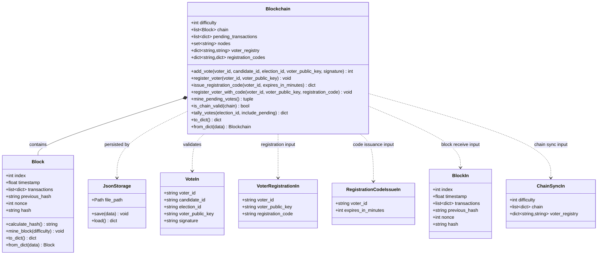
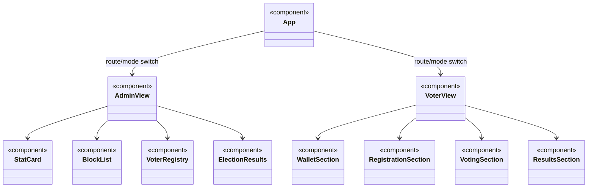

# Update Plan for Rebuilding the Project

## Purpose

This document serves as the formal technical reference for updating the current project into the workflow described in [workflow_description.md](workflow_description.md).

The system will remain fully custom and local. It must **not** depend on Ethereum, MetaMask, Solidity, or any chain-specific wallet tooling. The implementation will be developed from scratch using the existing Python, FastAPI, and React stack as the base foundation.

## Executive Summary

The project is a blockchain-inspired voting platform built around locally generated wallets, signed vote submission, node-side verification, persistent duplicate prevention, Proof-of-Work mining, and peer-to-peer block propagation. The report should emphasize the algorithmic and system-design contributions rather than the user interface alone.

The principal technical contribution of the project is the end-to-end voting pipeline:

- deterministic vote canonicalization,
- Ed25519-based vote authentication,
- one-vote-per-election enforcement,
- Proof-of-Work block construction,
- block validation and consensus,
- and persistent JSON-backed recovery.

The user-facing admin and voter dashboards will be implemented later as presentation layers on top of this core system.

## Project Goal

Build a blockchain-style voting system where:

1. A voter creates a local wallet.
2. The voter registers a public key with a node.
3. The voter signs a vote locally.
4. The node verifies the signature, voter registration, and duplicate-vote rules.
5. Valid votes enter a pending pool.
6. A miner mines pending votes into a block with Proof-of-Work.
7. The block is broadcast to peers and validated by other nodes.
8. Election results are computed from the confirmed chain.

## Core Technical Contributions

The following components represent the substantive engineering work in this project and should be presented formally in the report:

1. A deterministic vote message format that ensures the same vote data always produces the same signed payload.
2. An Ed25519 signing and verification pipeline that authenticates votes at the node level.
3. A persistent voter registry that binds voter identities to public keys.
4. A duplicate-vote prevention mechanism that enforces one valid vote per election.
5. A Proof-of-Work mining model that packages verified votes into immutable blocks.
6. A block-validation and peer-broadcast mechanism that preserves chain consistency across nodes.
7. A JSON-based persistence layer that restores chain and registry state after restart.
8. A clear separation between transaction validation, block production, and results tallying.

## Design Overview

The design of the system follows a layered architecture. Each layer has a clear responsibility so the voting workflow remains auditable and easy to describe in the report.

### 1. Presentation Layer

The presentation layer provides the user-facing interface for interacting with the voting system. It is intended to include separate wallet, voter, and admin views. These views are not the trust boundary of the system; they only collect input, display state, and call backend APIs.

### 2. Application Layer

The application layer is implemented with FastAPI and acts as the control layer for all major operations. It receives requests for wallet registration, vote submission, mining, chain inspection, node synchronization, and results retrieval.

### 3. Verification Layer

The verification layer enforces the rules of the voting protocol. It performs canonical message reconstruction, signature verification, voter authorization checks, duplicate-vote detection, and block validation before any data is accepted into the chain.

### 4. Consensus Layer

The consensus layer is responsible for Proof-of-Work mining and peer-to-peer block propagation. Verified votes are grouped into candidate blocks, mined by hash search, and broadcast to connected peers. Each peer validates the block before appending it to its local chain.

### 5. Persistence Layer

The persistence layer stores the blockchain state, voter registry, and pending vote pool in JSON files. This makes the node restart-safe and supports multi-node demonstrations with independent local state.

### 6. Utility and Cryptography Layer

The utility layer contains the deterministic serialization, hashing, and signature helpers. This layer ensures that the client and server compute the same canonical vote payload and that all cryptographic operations remain consistent across the project.

## Implementation Overview

The implementation work completed in the project can be summarized as follows:

### 1. Wallet Generation and Identity Setup

Local wallets are generated using Ed25519 key pairs. The private key remains on the client side, while the public key is exported in base64 format for registration with the node. This establishes a verifiable identity model without external wallet providers.

### 2. Vote Canonicalization and Digital Signing

A deterministic vote message is generated from the voter identity, candidate identifier, and election identifier. The message is signed locally before submission so the backend can verify both authenticity and integrity.

### 3. Voter Registration and Authorization

The node stores a persistent mapping from voter ID to public key. Only registered voters are eligible to submit votes, which gives the system a controlled admission step before voting is accepted.

### 4. Vote Verification and Duplicate Prevention

Each submitted vote is checked on the server for valid signature, registered identity, and one-vote-per-election compliance. Duplicate submissions are rejected using persistent state so the rule survives restarts and applies consistently across requests.

### 5. Pending Vote Management

Valid votes are collected in a pending pool before mining. This separates vote acceptance from block creation and provides a clear staging area for the Proof-of-Work process.

### 6. Proof-of-Work Mining

Pending votes are assembled into blocks and mined by searching for a nonce that satisfies the configured difficulty target. This mechanism provides the major algorithmic component of the project and demonstrates how votes are finalized into immutable blocks.

### 7. Block Validation and Peer Broadcast

After mining, the new block is broadcast to registered peers. Each peer validates the block header, proof-of-work condition, and included vote data before appending the block to its local chain. If a peer falls behind, synchronization logic allows the chain to be reconciled.

### 8. Results Aggregation

The final election result is computed from the confirmed blockchain history. This ensures that tallying operates only on finalized data rather than on unverified or pending submissions.

### 9. Frontend and Interface Separation

The frontend provides a clean interaction surface for the core backend functions. Administrative and voter views are planned as separate interface modules, but they remain presentation-only features layered on top of the verified backend rules.

## What Must Be Removed or Avoided

- Ethereum-specific logic.
- MetaMask integration.
- Solidity contracts.
- Any dependency on public-chain concepts such as gas, chain IDs, RPC wallets, or smart contract deployment.
- Any UI or backend code that assumes Web3 provider injection.
- Any feature that makes the vote flow depend on third-party blockchain infrastructure.

## What Must Be Kept

- Local wallet creation.
- Public/private key generation.
- Vote signing and signature verification.
- Voter registry.
- Duplicate vote prevention.
- Pending vote pool.
- Proof-of-Work mining.
- Block broadcasting to peers.
- Chain validation and consensus.
- Results calculation per election.
- Frontend dashboard for wallet, vote, mining, chain, and results.
- Administrative and voter views to be added as presentation modules after the core backend logic is finalized.

## Current Project Baseline

The repo already has a good starting structure:

- Backend: [main.py](main.py), [blockchain.py](blockchain.py), [block.py](block.py), [crypto_utils.py](crypto_utils.py), [storage.py](storage.py).
- CLI helpers: [generate_wallet.py](generate_wallet.py), [register_voter.py](register_voter.py), [add_vote.py](add_vote.py), [mine_and_broadcast.py](mine_and_broadcast.py).
- Frontend: [frontend/src/App.jsx](frontend/src/App.jsx), [frontend/src/api.js](frontend/src/api.js), [frontend/src/wallet.js](frontend/src/wallet.js), [frontend/src/styles.css](frontend/src/styles.css).
- Docs: [README.md](README.md), [workflow_description.md](workflow_description.md), [algorithms_and_workflows.md](algorithms_and_workflows.md).

The update work should refine this into a clean end-to-end implementation that matches the workflow document exactly, with the main emphasis on the security pipeline, mining logic, and verification flow.

## Required Changes by Area

### 1. Wallet System

Implement a local wallet flow with Ed25519 key pairs.

Needed changes:

- Generate a keypair locally in both CLI and browser flows.
- Store the private key only on the client side.
- Export the public key in a transport-safe format such as base64.
- Ensure wallet creation returns a stable voter identity for the local app.
- Keep the wallet code independent from any Ethereum wallet concepts.

Report emphasis:

- Explain the wallet as the basis for identity management in the voting system.
- Highlight that private keys remain local while public keys are registered with the node.

Files likely involved:

- [generate_wallet.py](generate_wallet.py)
- [frontend/src/wallet.js](frontend/src/wallet.js)
- [crypto_utils.py](crypto_utils.py)

### 2. Voter Registration

Implement voter registration as a node-side public key registry.

Needed changes:

- Add or keep `POST /voters/register` as the registration endpoint.
- Persist the mapping from `voter_id` to `voter_public_key`.
- Allow optional admin protection through a token if the deployment requires it.
- Add a clean validation path for empty IDs, duplicate registrations, and malformed keys.
- Make the registration flow usable from both the CLI helper and the browser UI.

Report emphasis:

- Present the registry as the authorization layer that links a voter identity to a verifiable public key.
- Describe registration as a prerequisite for accepting votes into the network.

Files likely involved:

- [main.py](main.py)
- [storage.py](storage.py)
- [register_voter.py](register_voter.py)
- [frontend/src/api.js](frontend/src/api.js)
- [frontend/src/App.jsx](frontend/src/App.jsx)

### 3. Vote Signing and Submission

Implement deterministic vote canonicalization and Ed25519 signing.

Needed changes:

- Define one canonical message format for `voter_id`, `candidate_id`, and `election_id`.
- Make the frontend and backend use the exact same serialization rules.
- Sign the canonical bytes locally before submission.
- Submit the signed payload with the public key and signature attached.
- Reject malformed payloads early.

Report emphasis:

- Describe the canonicalization step as a deterministic preprocessing stage.
- Explain how signature generation protects the integrity and origin of the vote.

Files likely involved:

- [crypto_utils.py](crypto_utils.py)
- [frontend/src/wallet.js](frontend/src/wallet.js)
- [frontend/src/api.js](frontend/src/api.js)
- [add_vote.py](add_vote.py)
- [main.py](main.py)

### 4. Server-Side Vote Verification

The node must enforce vote validity before accepting anything into the pending pool.

Needed changes:

- Verify the Ed25519 signature against the canonical vote message.
- Confirm that the voter is registered.
- Confirm that the vote is not a duplicate for that election.
- Reject invalid or forged votes with clear error messages.
- Keep the verification path deterministic and identical across nodes.

Report emphasis:

- Frame this as the core trust boundary of the system.
- Show that the node acts as the enforcing authority for registration, authenticity, and eligibility.

Files likely involved:

- [main.py](main.py)
- [blockchain.py](blockchain.py)
- [crypto_utils.py](crypto_utils.py)
- [storage.py](storage.py)

### 5. Duplicate Vote Protection

Prevent one voter from voting more than once in the same election.

Needed changes:

- Track accepted votes by `voter_id` and `election_id`.
- Check for duplicates before accepting a new vote.
- Make the duplicate check persistent, not only in memory.
- Ensure concurrent submissions cannot bypass the rule.
- If needed, add a fast path for likely duplicates, but keep persistence as the source of truth.

Report emphasis:

- Present duplicate prevention as a formal voting constraint, not a UI-level rule.
- State clearly that the persistent record is the authoritative source of truth.

Files likely involved:

- [blockchain.py](blockchain.py)
- [storage.py](storage.py)
- [main.py](main.py)

### 6. Pending Vote Pool

Votes that pass verification should enter a pending queue before mining.

Needed changes:

- Maintain a pending vote list in the blockchain state.
- Expose it in the API if the UI needs to display it.
- Clear pending votes only after they are included in a valid block.
- Keep the pool consistent with the stored chain and duplicate rules.

Report emphasis:

- Describe the pending pool as the staging area before block creation.
- Explain that only verified votes can move forward to mining.

Files likely involved:

- [blockchain.py](blockchain.py)
- [main.py](main.py)

### 7. Block Structure and Mining

Implement the block model and Proof-of-Work mining.

Needed changes:

- Ensure the block stores the previous hash, timestamp, nonce, vote list, and miner metadata if needed.
- Hash all important block fields consistently.
- Mine by finding a hash that satisfies the configured difficulty.
- Add validation rules so other nodes can verify the mined block.
- Keep mining simple, deterministic, and easy to explain in the report.

Report emphasis:

- This is one of the major algorithmic contributions of the project.
- Explain Proof-of-Work as the mechanism that converts verified votes into tamper-resistant blocks.
- Highlight nonce search, hash difficulty, and chain linkage as the essential mining steps.

Files likely involved:

- [block.py](block.py)
- [blockchain.py](blockchain.py)
- [main.py](main.py)

### 8. Peer Broadcast and Consensus

Nodes should share mined blocks and resolve chain differences.

Needed changes:

- Keep peer registration support.
- Broadcast new blocks to peers after mining.
- Allow peers to validate a received block before appending it.
- Provide a fallback chain sync path if a peer is behind.
- Keep longest-chain or most-work resolution simple and explicit.

Report emphasis:

- Present broadcast and consensus as the distributed consistency mechanism of the system.
- Explain how peer validation prevents invalid blocks from being accepted into the chain.

Files likely involved:

- [main.py](main.py)
- [blockchain.py](blockchain.py)
- [docker-compose.yml](docker-compose.yml)

### 9. Results Tallying

Election results should come from the confirmed chain.

Needed changes:

- Add or keep an endpoint that returns results for a given `election_id`.
- Aggregate vote counts from the validated blockchain history.
- Make the tally output easy to consume in the frontend.
- Keep the tally logic separate from vote acceptance logic.

Report emphasis:

- State that tallying operates only on confirmed blocks.
- Describe the tally output as the final audit layer for the election process.

Files likely involved:

- [blockchain.py](blockchain.py)
- [main.py](main.py)
- [frontend/src/api.js](frontend/src/api.js)
- [frontend/src/App.jsx](frontend/src/App.jsx)

### 10. Frontend Dashboard

The UI should support the full workflow without Web3 dependencies. Administrative and voter views are to be added later; this phase should remain focused on the functional core and the data flow required by the report.

Needed changes:

- Wallet screen: create, view, and clear a local wallet.
- Registration screen: register the wallet public key with a node.
- Vote screen: choose candidate and election, sign locally, submit vote.
- Mining screen: trigger mining and show status.
- Results screen: fetch and display tally output.
- Chain screen: inspect blocks and pending vote counts.
- Keep the design clean, simple, and specific to the voting workflow.

Report emphasis:

- Treat the frontend as a visualization and interaction layer, not the core of the implementation.
- Keep the interface modular so separate admin and voter pages can be introduced without changing the backend rules.

Files likely involved:

- [frontend/src/App.jsx](frontend/src/App.jsx)
- [frontend/src/api.js](frontend/src/api.js)
- [frontend/src/wallet.js](frontend/src/wallet.js)
- [frontend/src/styles.css](frontend/src/styles.css)

### 11. Persistence and Recovery

The node should survive restarts without losing state.

Needed changes:

- Persist chain, pending votes, and voter registry to local storage.
- Load state on startup.
- Validate loaded data before using it.
- Keep one storage format used by all nodes.
- Ensure each node can run independently with its own data file.

Report emphasis:

- Emphasize that persistence makes the system reproducible and resilient across restarts.
- Present recovery as part of the system’s reliability and maintainability story.

### 12. Documentation and Presentation Quality

The report and supporting documentation should read like an official academic system build, not a casual prototype note.

Needed changes:

- Use formal terminology throughout the report.
- Describe algorithms, validation rules, and state transitions explicitly.
- Avoid unrelated or template-derived content.
- Keep the language aligned with a final-year project submission.
- Reserve UI expansion items, such as separate admin and voter views, for the implementation roadmap rather than the main contribution narrative.

### 13. One-Time Registration Codes

The registration flow now separates wallet creation from voter eligibility.

Implementation notes:

- The voter creates a local wallet first.
- An administrator issues a one-time registration code for that wallet identity.
- The code is stored in the node database in hashed form with an expiry time.
- During registration, the voter submits the wallet public key together with the code.
- The node verifies the code, binds the wallet to the voter record, and deletes the code from storage.

Report emphasis:

- Present this as a one-time eligibility credential rather than a voting credential.
- Explain that the code is consumed during registration and is not reused for ballot submission.
- Note that this improves one-person-one-wallet control, while ballot secrecy still depends on how identity mappings are handled after registration.

Report emphasis:

- Present the project as a complete technical system with clearly defined algorithms.
- Make the Proof-of-Work, verification, and persistence components the strongest part of the narrative.

Files likely involved:

- [storage.py](storage.py)
- [main.py](main.py)
- [blockchain_data.json](blockchain_data.json)
- [data/node1.json](data/node1.json)
- [data/node2.json](data/node2.json)
- [data/node3.json](data/node3.json)

## Implementation Priority

### Phase 1: Core backend correctness

1. Confirm wallet canonicalization and signature verification.
2. Lock down voter registration.
3. Enforce one vote per voter per election.
4. Make pending vote storage stable.

### Phase 1 narrative focus

- The first phase establishes the correctness of the voting protocol.
- The report should describe this phase as the foundation of system integrity and trust.

### Phase 2: Mining and chain sharing

1. Finalize block structure.
2. Complete Proof-of-Work mining.
3. Validate block receiving and broadcast.
4. Make chain sync reliable across nodes.

### Phase 2 narrative focus

- This phase demonstrates the algorithmic depth of the system.
- The report should highlight Proof-of-Work, block linkage, and consensus verification as the principal computational mechanisms.

### Phase 3: Frontend workflow

1. Make wallet creation and registration easy.
2. Make vote submission fully signed and local.
3. Add mining and results views.
4. Polish chain and status display.

### Phase 3 narrative focus

- This phase presents the operational interface on top of the verified backend.
- Separate admin and voter dashboards may be introduced here or in a later revision, but they should not displace the core algorithmic narrative.

### Phase 4: Clean-up and documentation

1. Remove any stale Ethereum/Web3 terminology.
2. Align README and workflow docs with the implemented system.
3. Add test examples and demo commands.
4. Confirm the repo is explainable end-to-end.

### Phase 4 narrative focus

- The final phase turns the implementation into a defensible report submission.
- Documentation should read as an integrated system description with formal terminology and clear technical ownership.

## Acceptance Criteria

The rebuild is complete when all of the following are true:

- A wallet can be created locally.
- A voter public key can be registered on a node.
- A vote can be signed locally and submitted.
- Invalid signatures are rejected.
- Unregistered voters are rejected.
- Duplicate votes for the same election are rejected.
- Valid votes enter a pending pool.
- Mining creates a valid block.
- The block is broadcast and accepted by peers.
- Election results are readable from the confirmed chain.
- The frontend supports the full flow without Ethereum, MetaMask, or Solidity.

## Report Presentation Guidance

## Class Diagrams

The codebase is mostly Python dataclasses and service objects on the backend, plus React components on the frontend. For the report, the most accurate class diagram is the backend domain model and storage layer.

For the frontend, a component diagram is usually more accurate than a class diagram because the UI is written in React function components rather than classes. If you want to include it in the report, the most faithful representation is:

These diagrams are accurate to the current implementation and can be copied into the final report as the system structure section.

When writing or revising the report, the following points should be treated as the main technical story:

- The system is built around signed vote messages rather than external blockchain wallets.
- The node is responsible for verification, eligibility checks, duplicate prevention, and final acceptance.
- Proof-of-Work is the mechanism used to demonstrate mining, immutability, and block finalization.
- The blockchain is used as a local consensus and audit structure, not as a public-chain deployment.
- Admin and voter views are interface layers to be added after the core protocol is complete.
- Any irrelevant template content should be removed from the report entirely.

## Open Work Notes

- Keep the canonical vote message format fixed once implemented.
- Keep the storage format stable so CLI, backend, and frontend do not drift.
- If any old UI or docs mention Ethereum or MetaMask, replace them with the local-wallet flow.
- If an optional security feature is added later, document it here before implementation.

## How To Use This File Later

Use this document as the source of truth before making code changes. When starting a task, update the relevant section here first, then implement the code to match it.
